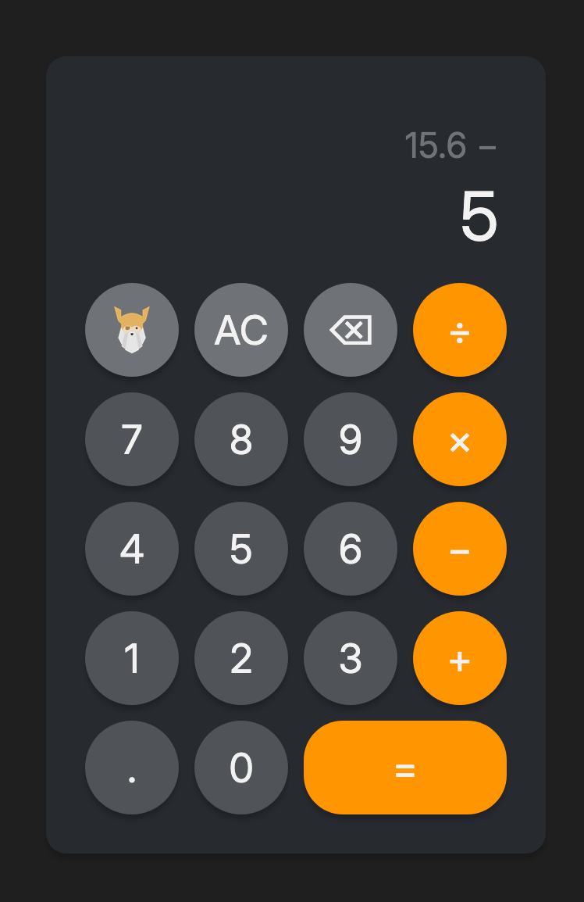

# Odin Calculator

A calculator that handles basic arithmetic.

Learn more about this project in [TOP's Foundation Course: JavaScript Basics](https://www.theodinproject.com/lessons/foundations-calculator).

## Notes

**Notable project change**:

- After an operator is selected, the first operand and that operator are displayed on a different line.
- When a result is displayed, pressing a new digit does not start a new calculation, but continues the equation. (may adjust in future)

**Known Bugs**:

- If an answer to an equation is 0, adding an operand 0 < n < 1 such as 0.1, then selecting an operator, the previous value will change back to 0.

**Future Adjustments**:

- Replace Odin Button with % functionality.
- Add keyboard accessibility.
- Add more operators such as exponents, factorials, square roots, logs, etc.

## Preview

