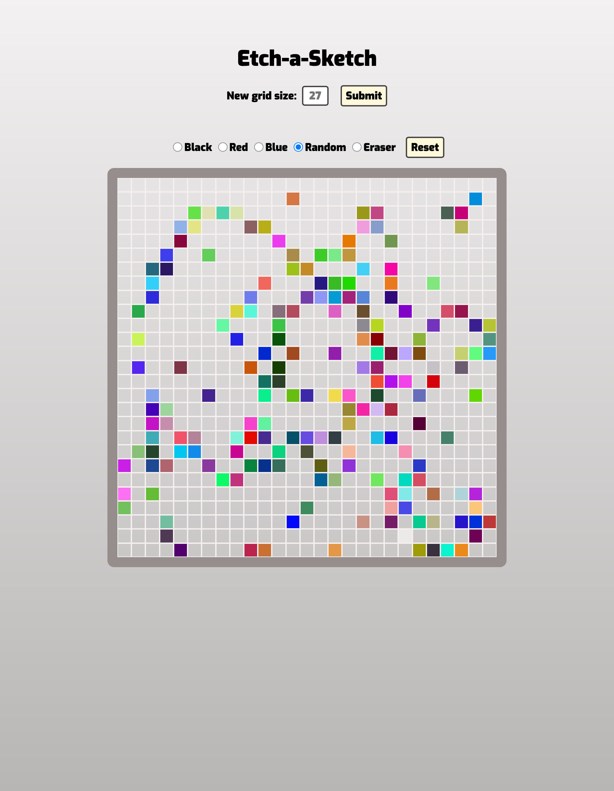

# Etch-a-Sketch

This project makes use of all the DOM manipulation skills learned up to this point with an interactive etch-a-sketch project.

Learn more about this project in [TOP's Foundation Course: JavaScript Basics](https://www.theodinproject.com/lessons/foundations-etch-a-sketch).

## Acknowledgment

Project assistance/guidance from **Self Taught Dev**.

- View channel's [YouTube explanation](https://youtu.be/Ydw9HmoLggM?si=sgy1kQp2cRDmq98x).
- View video's [linked repository](https://github.com/kasugaijin/etch-a-sketch/tree/main).
