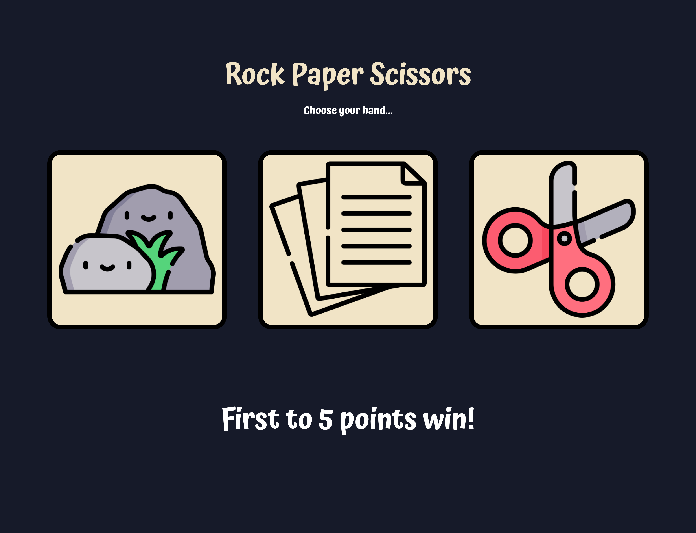
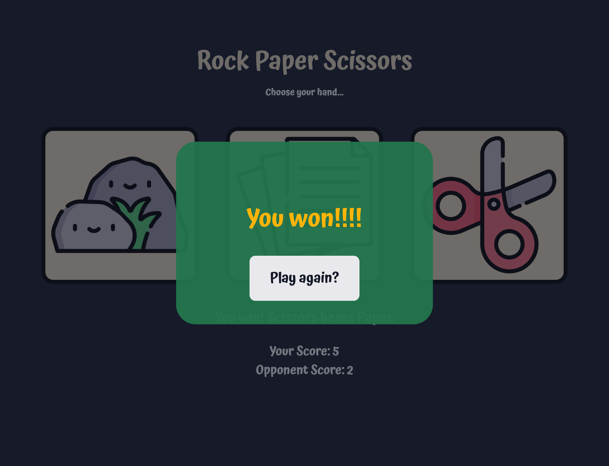

# Rock Paper Scissors

A basic rock-paper-scissors game in which the user plays against the computer.

## v1.0.0

This is the first JavaScript project in T.O.P.'s Foundations course, in which the main task is to create the game **_Rock Paper Scissors_**. This game will be played entirely in the console, and assumes that user input is correct (although input is not case-sensitive).

## v2.0.0

Revisiting this project after learning about DOM manipulation, the main task of this version is to implement a user interface.

## v3.0.0

Enhancing the entire user experience by further updating the UI to be more attractive to user while maintaining an easy navigation. Responsive design is considered to an extent.

### Icon Attributions

[Document icons created by Freepik - Flaticon](https://www.flaticon.com/free-icons/document)

[Scissors icons created by Freepik - Flaticon](https://www.flaticon.com/free-icons/scissors)

[Rock icons created by Freepik - Flaticon](https://www.flaticon.com/free-icons/rock)

## Preview

